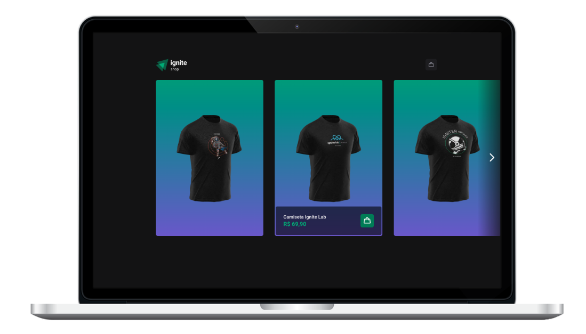

 

 

 

  
  
  

  

 

## 🚀 Features

1. **Product Listing and Cart Functionality:** Users can browse and add products to their cart, allowing them to select and manage the items they wish to purchase.

2. **Checkout Integration with Stripe:** Seamless integration with Stripe's payment gateway enables secure and convenient payment processing for users during the checkout process.

3. **Success Buy URL Page:** After completing a successful purchase, users are redirected to a dedicated page that confirms the transaction and provides a clear indication of a successful buy.

 

## 🛠️ Technologies

This application is built using the following technologies:

- [NextJS](https://nextjs.org/)
- [React](https://reactjs.org/)
- [TypeScript](https://www.typescriptlang.org/)
- [Vite](https://vitejs.dev/)
- [React Hooks](https://reactjs.org/docs/hooks-intro.html)
- [Stripe](https://stripe.com)

 

## 🚀 Getting Started

Follow these steps to get started with the Timer Application:

1. Clone the repository to your local machine.

2. Install dependencies using the command `npm install`.

3. Start the development server using the command `npm run dev`.

4. In your browser, navigate to `http://localhost:3000` to access the application.

 

## 🚀 Creating a Production Build

To create a production build of the Timer Application, follow these steps:

1. Run the command `npm run build`.

2. Run `npm start` to run `.next` build file

 

## 🤝 Contributing

Contributions to this project are welcome. To contribute, follow these steps:

1. Fork the repository.

2. Create a new branch.

3. Make your changes and commit them.

4. Push to the new branch.

5. Create a pull request.

 

## 📝 License

This project is licensed under the MIT License.